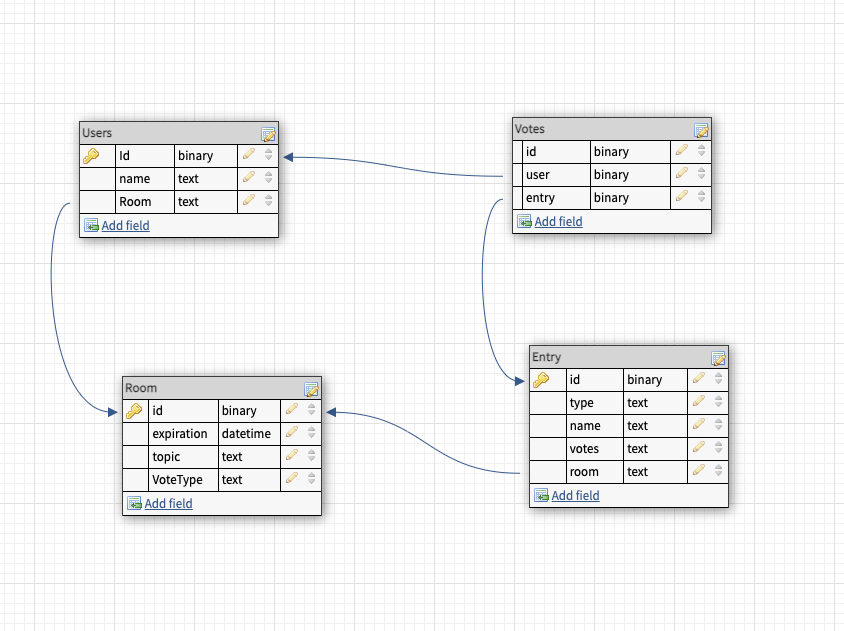

# second-breakfast-server

# standing up and building database

1. `npm install`
2. `npx knex migrate:latest` this creates the database
3. `npm start` stands up server listening to port 3030

# Database model

Database design as of 9/13

